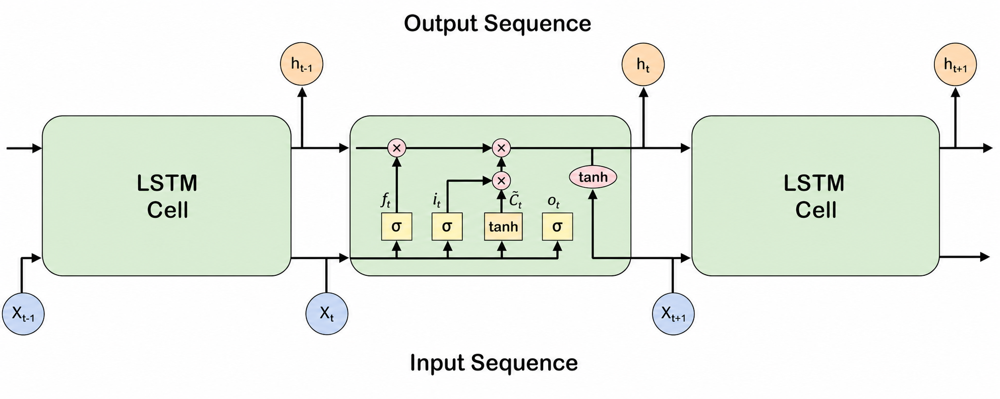
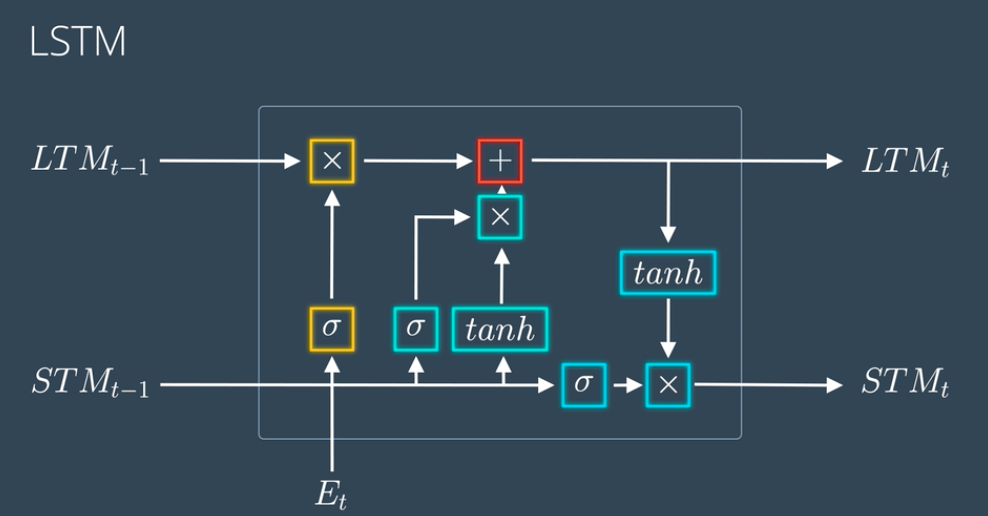
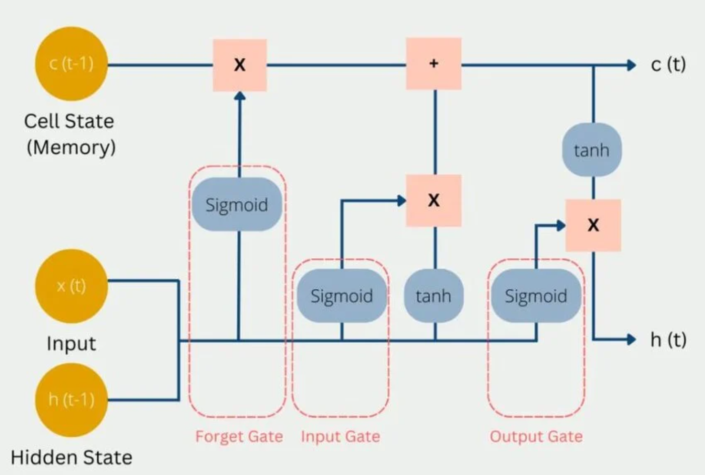

# Long Short-Term Memory (LSTM) Networks

## 1. Introduction to LSTMs

**Long Short-Term Memory (LSTM)** is a specialized variant of Recurrent Neural Networks (RNNs). LSTMs were specifically designed to overcome the **vanishing and exploding gradient problems** inherent in traditional RNNs when processing long sequential data.

In Natural Language Processing (NLP), text features context dependencies across long distances (e.g., matching a subject at the start of a paragraph with a verb at the end). Standard RNNs struggle to preserve information across long time steps, whereas LSTMs are engineered to remember relevant information over long periods and forget irrelevant context.

---

## 2. Why Standard RNNs Fail (The Vanishing Gradient Problem)

In a standard RNN, hidden states are updated recursively at each time step $t$:

$$h_t = \tanh(W_h h_{t-1} + W_x x_t + b)$$

During **Backpropagation Through Time (BPTT)**, gradients are computed by repeatedly multiplying weight matrices across time steps:

$$\frac{\partial L}{\partial h_1} = \frac{\partial L}{\partial h_T} \prod_{t=2}^{T} \frac{\partial h_t}{\partial h_{t-1}}$$

* **Vanishing Gradient:** If the eigenvalues of $W_h$ are less than 1, gradients diminish exponentially as sequence length $T$ increases, causing the network to forget early tokens.
* **Exploding Gradient:** If eigenvalues exceed 1, gradients grow exponentially, causing numerical instability and NaN losses.

LSTMs fix this by creating an **additive memory pathway** called the **Cell State ($c_t$)**, allowing gradients to flow unimpeded backward through time.

---

## 3. Core Concept: The Dual State Architecture

Unlike standard RNNs which have a single hidden state ($h_t$), LSTMs maintain two distinct vectors at each time step:

1. **Cell State ($c_t$):** The long-term memory highway of the network. It undergoes minimal linear interactions, preserving information across many steps.
2. **Hidden State ($h_t$):** The short-term memory and working output of the network at time step $t$.

Information flow into and out of the cell state is regulated by **Gating Mechanisms**.

---

## 4. Gating Mechanisms & Mathematical Formulations

LSTMs utilize **three gates** composed of Sigmoid ($\sigma$) activation functions acting as soft switches (yielding values in the range $[0, 1]$), combined with element-wise (Hadamard) multiplication ($\odot$).

 
 
 

### 4.1 Forget Gate ($f_t$)
* **Purpose:** Decides what information to discard from the previous cell state $c_{t-1}$.
* **Mechanism:** Looks at the previous hidden state $h_{t-1}$ and current input $x_t$. Output range $[0, 1]$ ($0 = \text{completely forget}$, $1 = \text{completely retain}$).
* **Equation:**
  $$f_t = \sigma(W_f \cdot [h_{t-1}, x_t] + b_f)$$

### 4.2 Input Gate ($i_t$) & Candidate State ($\tilde{c}_t$)
* **Purpose:** Decides what new information to add to the cell state $c_t$.
* **Mechanism:**
  1. **Input Gate ($i_t$):** Determines *which* values to update using a sigmoid layer.
  2. **Candidate State ($\tilde{c}_t$):** Generates a vector of *new candidate values* using a $\tanh$ layer (range $[-1, 1]$).
* **Equations:**
  $$i_t = \sigma(W_i \cdot [h_{t-1}, x_t] + b_i)$$
  $$\tilde{c}_t = \tanh(W_c \cdot [h_{t-1}, x_t] + b_c)$$

### 4.3 Cell State Update ($c_t$)
* **Purpose:** Combines the past memory (scaled by forget gate) and the new candidate memory (scaled by input gate).
* **Mechanism:** Element-wise addition ensures additive gradient propagation.
* **Equation:**
  $$c_t = f_t \odot c_{t-1} + i_t \odot \tilde{c}_t$$

### 4.4 Output Gate ($o_t$) & Hidden State Output ($h_t$)
* **Purpose:** Determines what the next hidden state $h_t$ should be (to pass to the next time step and upper neural network layers).
* **Mechanism:**
  1. **Output Gate ($o_t$):** Filters which parts of the cell state to expose using a sigmoid layer.
  2. **Hidden State ($h_t$):** Scales the cell state $c_t$ using $\tanh$ and multiplies it by $o_t$.
* **Equations:**
  $$o_t = \sigma(W_o \cdot [h_{t-1}, x_t] + b_o)$$
  $$h_t = o_t \odot \tanh(c_t)$$

---

## 5. Summary of Equations

| Component | Variable | Equation | Function / Range |
| :--- | :--- | :--- | :--- |
| **Forget Gate** | $f_t$ | $\sigma(W_f \cdot [h_{t-1}, x_t] + b_f)$ | Decides what to drop ($[0, 1]$) |
| **Input Gate** | $i_t$ | $\sigma(W_i \cdot [h_{t-1}, x_t] + b_i)$ | Decides what to update ($[0, 1]$) |
| **Candidate Memory** | $\tilde{c}_t$ | $\tanh(W_c \cdot [h_{t-1}, x_t] + b_c)$ | Creates candidate values ($[-1, 1]$) |
| **New Cell State** | $c_t$ | $f_t \odot c_{t-1} + i_t \odot \tilde{c}_t$ | Updates long-term memory |
| **Output Gate** | $o_t$ | $\sigma(W_o \cdot [h_{t-1}, x_t] + b_o)$ | Decides what to reveal ($[0, 1]$) |
| **New Hidden State** | $h_t$ | $o_t \odot \tanh(c_t)$ | Working memory & output for step $t$ |

---

## 6. How LSTMs Solve the Vanishing Gradient Problem

The key mathematical reason LSTMs avoid vanishing gradients during BPTT lies in the cell state gradient formula:

$$\frac{\partial c_t}{\partial c_{t-1}} = f_t + \text{terms involving derivatives of gates}$$

If the network learns to keep the forget gate $f_t \approx 1$, the gradient derivative $\frac{\partial c_t}{\partial c_{t-1}} \approx 1$. 

Unlike standard RNNs where gradients decay exponentially via matrix multiplications ($\prod W_h$), LSTM gradients flow back through time linearly along the cell state **Constant Error Carousel (CEC)** without vanishing to zero.

---

## 7. Popular LSTM Variants

1. **Peephole Connections (Gers & Schmidhuber, 2000):**
   Allows gate layers to inspect the cell state $c_{t-1}$ directly when computing gate activations:
   $$f_t = \sigma(W_f \cdot [c_{t-1}, h_{t-1}, x_t] + b_f)$$

2. **Bidirectional LSTM (BiLSTM):**
   Processes sequences in two directions simultaneously:
   - **Forward LSTM:** Reads sequence from start to end ($x_1 \to x_T$).
   - **Backward LSTM:** Reads sequence from end to start ($x_T \to x_1$).
   Outputs are concatenated: $h_t = [h_t^{\text{forward}} \,;\, h_t^{\text{backward}}]$.

3. **Gated Recurrent Unit (GRU):**
   A simplified architecture introduced by Cho et al. (2014) that merges cell state and hidden state into a single state ($h_t$) and combines gates into an **Update Gate** ($z_t$) and **Reset Gate** ($r_t$).

---

## 8. Applications in Sentiment Analysis & NLP

In sentiment analysis tasks:
1. **Word Embeddings:** Input text tokens are converted to embedding vectors $x_t \in \mathbb{R}^d$.
2. **Sequential Encoding:** LSTM processes words step-by-step, building a contextualized document vector in the final hidden state $h_T$ (or via pooling over all $h_t$).
3. **Classification:** $h_T$ is fed into a Dense layer with Sigmoid/Softmax activation to predict sentiment probabilities (e.g., Positive vs. Negative).